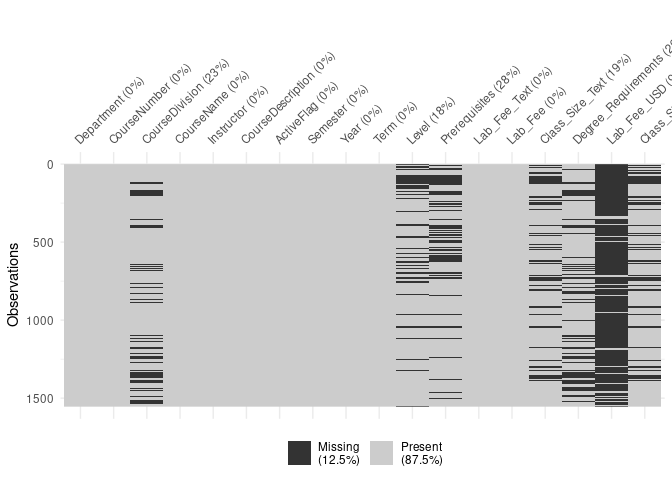
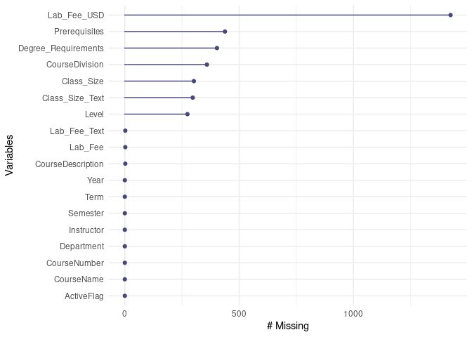
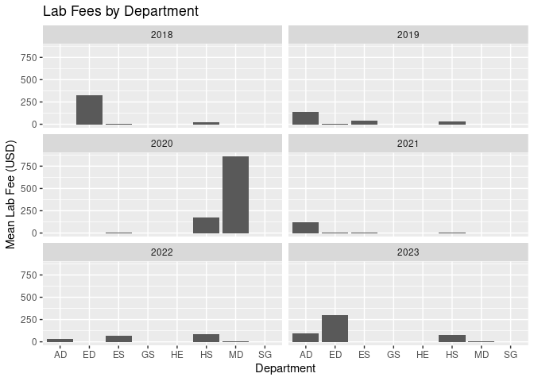

Tidy Courses Proposal
================
Nils and Juliana

``` r
library(tidyverse)
library(broom)
```

``` r
coa_courses <- read_excel("data/coa-courses.xlsx")
coa_courses2 <- read_csv("data/coa_courses2.csv")
```

    ## Rows: 1327 Columns: 15
    ## ── Column specification ────────────────────────────────────────────────────────
    ## Delimiter: ","
    ## chr (13): Department, CourseNumber, CourseDivision, CourseName, Instructor, ...
    ## dbl  (1): Year
    ## lgl  (1): ActiveFlag
    ## 
    ## ℹ Use `spec()` to retrieve the full column specification for this data.
    ## ℹ Specify the column types or set `show_col_types = FALSE` to quiet this message.

``` r
glimpse(coa_courses)
```

    ## Rows: 1,327
    ## Columns: 8
    ## $ Department        <chr> "AD", "AD", "AD", "AD", "AD", "AD", "AD", "AD", "AD"…
    ## $ CourseNumber      <chr> "1011", "1011", "1011", "1012", "1012", "1012", "101…
    ## $ CourseDivision    <chr> "ADS", "ADS", "ADS", "ADS", "ADS", "ADS", "AD HY", "…
    ## $ CourseName        <chr> "Introduction to Arts and Design", "Introduction to …
    ## $ Instructor        <chr> "Mancinelli, Isabel", "Mancinelli, Isabel", "Mancine…
    ## $ CourseDescription <chr> "This course is the fundamental course for students …
    ## $ ActiveFlag        <lgl> TRUE, TRUE, TRUE, TRUE, TRUE, TRUE, TRUE, TRUE, TRUE…
    ## $ Semester          <chr> "B18Q", "B19Q", "B20Q", "B20C", "B19B", "B18C", "B18…

``` r
coa_courses <- coa_courses %>%
  mutate(Year = str_c(20, str_extract(Semester, "\\d{2}")),
         Term = str_sub(Semester, start = 4, end = 4),
         Level = str_extract(CourseDescription, pattern = "Level: Intermediate|Level: Introductory|Level: Advanced"),
         Prerequisites = str_extract(CourseDescription, pattern = "Prerequisites[^.]+"),
         Lab_Fee_USD = str_extract(CourseDescription, pattern = "(?<=Lab fee\\: \\$)[^.]+"),
         Class_Size = str_extract(CourseDescription, pattern = "(?<=Class limit\\: )[^.]+"), # Try adapting for course fee
         Degree_Requirements = str_extract(CourseDescription, pattern = "(?<=Meets the following degree requirements\\: ).*"))

coa_courses3 <- coa_courses %>%
   separate_rows(Degree_Requirements, sep = ", ") %>%
   separate_rows(Degree_Requirements, sep = " ") %>%
   separate_rows(Degree_Requirements, sep = ",")

coa_courses3 %>%
  # distinct(Department, CourseNumber, Term, Year) %>% # This will be added to drop duplicates
  filter(Degree_Requirements %in% c("ES", "ADS", "AD", "QR", "HS", "HY")) %>%

  group_by(Year, Degree_Requirements) %>%
  summarize(number_courses_per_degree = n()) %>%
  ggplot(aes(x = Year, y = number_courses_per_degree, color = Degree_Requirements)) +
  geom_line(aes(group = Degree_Requirements))
```

    ## `summarise()` has grouped output by 'Year'. You can override using the
    ## `.groups` argument.

<!-- -->

``` r
write_csv(coa_courses, file = "data/coa_courses2.csv")
```

``` r
visdat::vis_dat(coa_courses3)
```

<!-- -->

``` r
visdat::vis_miss(coa_courses3)
```

<!-- -->

``` r
naniar::gg_miss_var(coa_courses3)
```

<!-- -->

``` r
ggplot(coa_courses3,
       aes(x = as.numeric(Class_Size), 
           y = as.numeric(Lab_Fee_USD))) + 
geom_miss_point(alpha = 0.5)
```

    ## Warning in FUN(X[[i]], ...): NAs introduced by coercion

    ## Warning in FUN(X[[i]], ...): NAs introduced by coercion

    ## Warning in FUN(X[[i]], ...): NAs introduced by coercion

    ## Warning in FUN(X[[i]], ...): NAs introduced by coercion

<!-- -->

``` r
instructors <- coa_courses2 %>% distinct(Instructor, Year)

instructors_distinct <- coa_courses2 %>% distinct(Instructor)

write_csv(instructors_distinct, file = "data/instructors.csv")

instructors <- instructors %>%
  mutate(instructor_status = case_when(Instructor %in% c("Anderson, John", 
                                              "Andrews, Nancy",
                                              "Baker, Jodi",
                                              "Baker, Laurie",
                                              "Borden, Richard",
                                              "Carpenter, William",
                                              "Cline, Ken",
                                              "Clinger, Catherine",
                                              "Colbert, Dru",
                                              "Collum, Kourtney",
                                              "Cooper, John",
                                              "Cox, Gray",
                                              "Feldman, David",
                                              "Foley, Sean",
                                              "Friedlander, Jay",
                                              "Gatti, Daniel",
                                              "Hall, Sarah",
                                              "Henderson, Jonathan",
                                              "Hess, Helen",
                                              "Hill, Kenneth",
                                              "Hudson, Reuben",
                                              "Kozak, Anne",
                                              "Letcher, Susan",
                                              "Little-Siebold, Todd",
                                              "Mancinelli, Isabel",
                                              "McKown, Jamie",
                                              "Morse, Suzanne",
                                               "Petersen Christopher",
                                              "Ressel, Stephen",
                                              "Schrade, Daniel Kojo",
                                              "Stabinsky, Doreen",
                                              "Tai, Bonnie",
                                              "Taneja , Palak",
                                              "Tardif, Twila",
                                              "Taylor, Davis",
                                              "Todd, Sean",
                                               "van Vliet, Netta",
                                                "Visvader, John",
                                                "Waldron, Karen") ~ "Permanent Faculty",
                          Instructor %in% c("Pena, Karla") & Year <= 2022 ~ "Lecturer",
                          Instructor %in% c("Pena, Karla") & Year > 2022 ~ "Permanent Faculty",
                           Instructor %in% c("Lakey, Heather") & Year <= 2021 ~ "Adjunct",
                          Instructor %in% c("Lakey, Heather") & Year > 2021 ~ "Permanent Faculty",
                            Instructor %in% c("Soares, Zachary") & Year >= 2022 ~ "Teaching Staff",
                            Instructor %in% c("Soares, Zachary") & Year < 2022 ~ "Adjunct",
                            Instructor %in% c("Cass, Blake", 
                                              "Fuller, Linda",
                                              "Gibson, David",
                                              "Teaching Staff",
                                              "Longsworth, Gordon") ~ "Teaching Staff",
                            Instructor %in% c("Beach, Desmond",
                                              "Chien, Ming-Tso",
                                              "Downing, E. Saffronia",
                                              "Oblongata, Donna") ~ "Visitor",
                           Instructor %in% c("Capers, Colin",
                                             "Donovan, Martha",
                                             "Levin, Robert",
                                             "Mahoney, Daniel",
                                              "Stover, Candice",
                                              "Swann, Scott",
                                              "Turok, Katharine",
                                              "Weber, Jill",
                                               "Winer, Joshua") ~ "Lecturer", TRUE ~ "Adjunct"))


coa_courses3 <- coa_courses3 %>%
  mutate(Year = as.numeric(Year)) %>%
left_join(instructors, by = c("Instructor", "Year"))

# An example of exploring a hypothetical what could count for resource area requirements
#coa_courses2 <- coa_courses2 %>%
  #mutate(course_counts = case_when(instructor_status %in% c("Permanent Teaching Staff", "Permanent full-time", "Permanent part-time")) ~ "Count",
        # TRUE ~ "Doesn't Count")
```

``` r
coa_courses3$Lab_Fee_USD <- as.numeric(gsub("[^0-9.]", "", coa_courses3$Lab_Fee_USD))

coa_courses3$Lab_Fee_USD[is.na(coa_courses3$Lab_Fee_USD)] <- 0

print(coa_courses3)
```

    ## # A tibble: 1,554 × 16
    ##    Department CourseNumber CourseDivision CourseName                  Instructor
    ##    <chr>      <chr>        <chr>          <chr>                       <chr>     
    ##  1 AD         1011         ADS            Introduction to Arts and D… Mancinell…
    ##  2 AD         1011         ADS            Introduction to Arts and D… Mancinell…
    ##  3 AD         1011         ADS            Introduction to Arts and D… Mancinell…
    ##  4 AD         1012         ADS            Introduction to Keyboard/P… Cooper, J…
    ##  5 AD         1012         ADS            Introduction to Keyboard/P… Cooper, J…
    ##  6 AD         1012         ADS            Introduction to Keyboard/P… Cooper, J…
    ##  7 AD         1013         AD HY          Jazz, Rock, and Blues:  Fr… Cooper, J…
    ##  8 AD         1013         AD HY          Jazz, Rock, and Blues:  Fr… Cooper, J…
    ##  9 AD         1013         AD HY          Jazz, Rock, and Blues:  Fr… Cooper, J…
    ## 10 AD         1013         AD HY          Jazz, Rock, and Blues:  Fr… Cooper, J…
    ## # ℹ 1,544 more rows
    ## # ℹ 11 more variables: CourseDescription <chr>, ActiveFlag <lgl>,
    ## #   Semester <chr>, Year <dbl>, Term <chr>, Level <chr>, Prerequisites <chr>,
    ## #   Lab_Fee_USD <dbl>, Class_Size <chr>, Degree_Requirements <chr>,
    ## #   instructor_status <chr>

``` r
ggplot(coa_courses3, aes(x = Department, y = Lab_Fee_USD)) +
  geom_bar(stat = "summary", fun = "mean") +
  labs(title = "Lab Fees by Department", x = "Department", y = "Mean Lab Fee (USD)") +
  facet_wrap(vars(Year), ncol = 2)
```

<!-- -->

``` r
ggplot(coa_courses3, aes(x = Department, y = Lab_Fee_USD)) +
  geom_boxplot() +
  labs(title = "Distribution of Lab Fees by Department", x = "Department", y = "Lab Fee (USD)")
```

<!-- -->

``` r
coa_courses3 %>%
  group_by(Year, Department, instructor_status) %>%
  summarize(course_total = n()) %>%
  ggplot() +
  geom_col(aes(x = Year, y = course_total, fill = instructor_status)) +
  facet_wrap(.~Department) +
  labs(y = "Course Total")
```

    ## `summarise()` has grouped output by 'Year', 'Department'. You can override
    ## using the `.groups` argument.

<!-- -->

## 1. Introduction

Every term during the registration period, the COA community navigates
the system of academic courses categorized by resource area
(department), course level, and the fulfillment of graduation
requirements. These categories, which shape decisions on the system
offering every term, are not as logical or functional as they could be.
This situation has sparked a variety of interrelated research questions
for this project. Our team will focus on the following questions:

- How are COA course offerings distributed across resource areas?
- How well are COA course offerings meeting students’ graduation
  requirement needs?
- How many courses are permanent and visiting faculty teaching,
  proportionally?
- What are the Lab fees in the different resource areas?
- How are class size in relation to resource areas?

The dataset we will use for this project was collected from the
Registrar records from the Winter of 2018 to the Spring of 2023. This
dataset contains 1327 observations or courses offered in an academic
year. Each observation has 15 variables: Department, Course Number,
Course Division, Course Name, Instructor, Course Description, Active
Flag, Semester, Year, Term, Level, Prerequisites, Class Size, and Degree
Requirements, Lab fee and class size.

## 2. Data

- \[Yes\] Is the data in the /data folder?
- \[Yes\] Does the README include the dimensions and codebook for the
  data set?
- \[Yes\] Does the proposal include the output of glimpse() or skim() of
  the data frame.

## 3. Ethics review

On our coa_courses3 dataset, some variables (columns) have an N/A or
blank space. These data shortcomings might limit the accuracy of our
data visualizations and summaries. The variables missing data are Level,
Prerequisites, Lab_fee_USD, Class_Size, and Degree_Requirements. Since
students make up our team, we will continue verifying information and
our interpretations of the data with Laurie, Krystal, Lothar, and Jamie
McKown. Additionally, our team will aim to communicate any limitations
on the visualizations and their accompanying texts when appropriate.

Moreover, our team anticipates that the Academic Affairs Committee (AAC)
and the COA community will benefit from our work in future
decision-making. As our college evolves, various stakeholders need to
figure out how to address the course-offering system’s shortcomings and
strengths to best cater to the needs of the student body and the work
capacity of our faculty. Our efforts will likely be the first step in an
in-depth data analysis of trends and possibilities that we hope are
expanded by future students to answer our questions and new ones that
arise more accurately.

## 4. Data analysis plan

We will create a visualization showing course distribution in their
respective resource areas throughout the years/ terms. We will also
create visualizations to show how many classes meet degree requirements
per resource area. Additionally we will make note of how many professors
are teaching classes that meet degree requirements per term.

We might possibly extend or reorganize the current dataset in groupings
that include the status of each instructor, visiting faculty, faculty,
lecturer, teaching staff and so on. This information will be provided by
Krystal, the Registrar, and Lothar, Academic Services Administrator.
